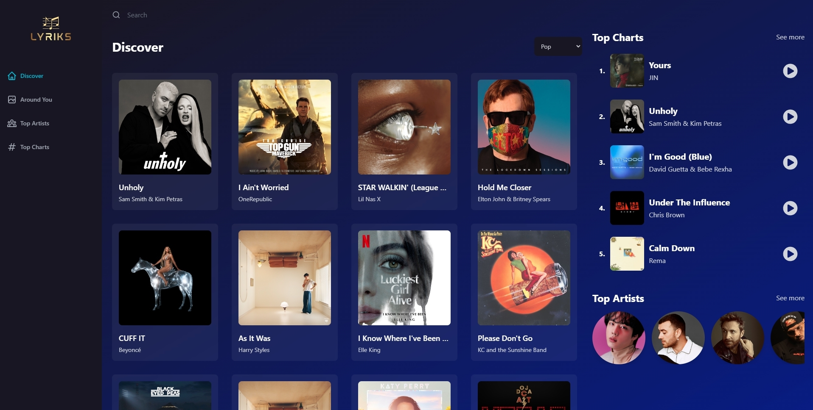
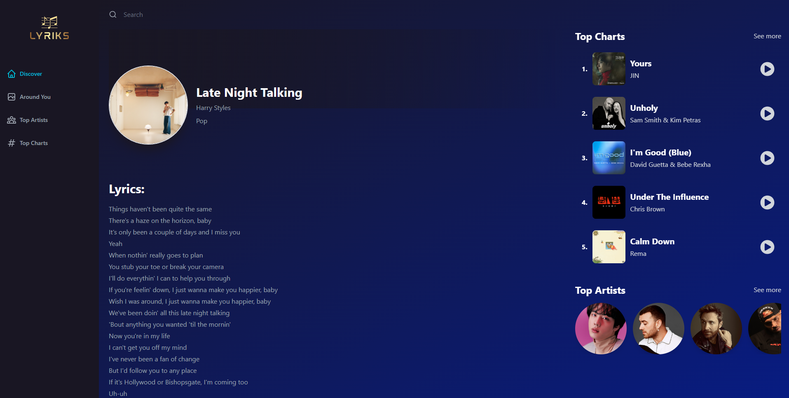
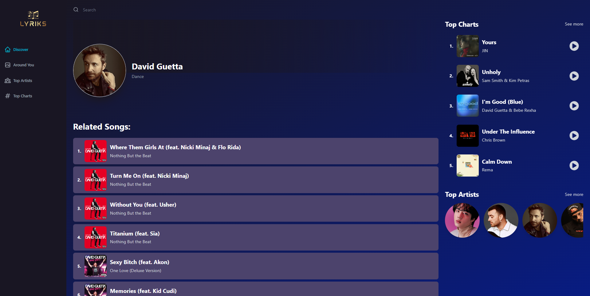

# Spotify Clone 2.0 React Website

You can view this project [here](https://lyrics-music-app.netlify.app).

## Built using:

Frontend:

- [React](https://reactjs.org)
- [Redux](https://redux.js.org)
- [Tailwind CSS](https://tailwindcss.com)
- [Swiper](https://swiperjs.com)
- [Axios](https://axios-http.com)
- [Vite](https://vitejs.dev)
- [GeoipifyAPI](https://www.geoapify.com)
- [RapidAPIs](https://rapidapi.com)

Deployment:

* [Netlify](https://www.netlify.com)

## Setup

- run `npm i && npm start`

## Getting Started

In the project directory, you can run:

### `npm start`

Runs the app in the development mode.\
Open [http://localhost:3000](http://localhost:3000) to view it in your browser.

The page will reload when you make changes.\
You may also see any lint errors in the console.
